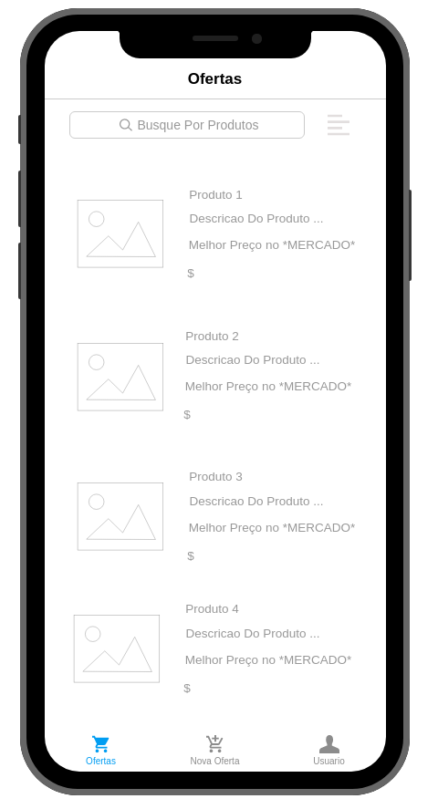

# Documento de Visão do Projeto EASY MARKET

Este documento apresenta uma solução de software para o projeto *"EASY MARKET"*.
apresentando os problemas a serem solucionados, as necessidades dos principais envolvidos, o alcance do projeto e as funcionalidades 
esperadas do sistema.

## Objetivos

* Facilitar as idas ao mercado.
* Locallizar as melhores ofertas, de forma rápida e pratica.
* Criar Uma rede de colaboração de ofertas, fazendo com que os proprios usuarios se engajem para a alimentação do banco de dados do projeto.

## Problema

* Descrição do problema: Falta de uma plataforma onde podemos comparar os preções de diferentes mercados da minha região, com informações atualizadas e seguras, sugeridas pelos próprios usuarios.
* Quem é afetado pelo problema: Responsaveis pelas compras da casa.
* Impacto no negócio: Consumiidores em geral
* Benefícios de uma boa solução: Diminuição dos preços, melhores ofertas.

## Definições, abreviações e outros termos do domínio do problema

* Ofertas: preços mais baixos que o comum.
* Proços: valor do produto
* Mercado: loja de produtos.

## Integração com outros sistemas

* Firebase: sistema de autenticação.
 
## Interessados

* Consumidores em geral.
* Aficcionados por ofertas.

## Usuários

* Usuario Comum, sem necessidade de conhecimentos tecnicos.

## Funcionalidades do produto

* Busca de Produtos
* Filtros para ordenação
* Cadastro de usuario
* Cadastro de ofertas
* Feedback das ofertas
* Geolocalização (para identificar os mercados mais proximos)
* Login com redes Sociais (Facebook, Twitter, Google)

## Restrições do projeto

* O Aplicativo será exclusivo para plataformas mobile (IOS e Android)
* Será Necessario um cadastro de usuario
* Acesso a Internet

## Protótipos de tela

### Protótipos para funcionalidade 1, 2

### Protótipos para funcionalidade 4, 6

### Protótipos para funcionalidade 7

### Protótipos para funcionalidade 3

### Protótipos para funcionalidade 5

