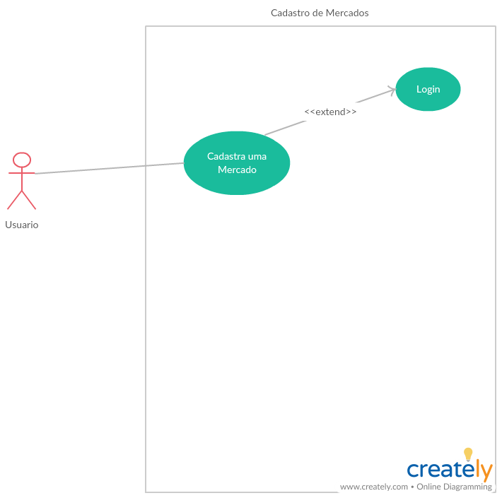

# Casos de uso

## 1. Diagrama de casos de uso

**Busca de Ofertas**

## 2. Especificação dos casos de uso

### 2.1. Caso de uso **Busca de Ofertas**

| Campo          | Informação        |
|---|---|
| Identificador: | UC01              |
| Nome:          | Busca de ofertas |
| Atores:        | Usuarios |
| Sumário:       | Busca uma oferta no sistema |

| Fluxo Principal |
|---|
| 1) O usuario realiza o login no sitema. |
| 2) O sistema recupera as informações dos produtos.                   |
| 3) O sistema apresenta a lista de produtos relacionados na pagina inicial. |
| 4) O usuario **Seleciona Produto Desejado** |
| 5) O sistema exibe as informações do produto para o usuario. |

| Fluxo Alternativo (2): O usuario deseja filtrar os produtos. |
|---|
| 1) O usuario realiza o login no sitema. |
| 2) O sistema recupera as informações dos produtos.                   |
| 3) O sistema apresenta a lista de produtos relacionados na pagina inicial. |
| 4) O usuario **Digita na busca o produto desejado** |
| 5) O sitema exibe as informações do produto para o usuario. |

| Fluxo Alternativo (3): A oferta não está mais disponivel. |
|---|
| 1) O usuario **Marca Oferta como vencida**. |

**Login**

### 2.2. Caso de uso **Login**

| Campo          | Informação        |
|---|---|
| Identificador: | UC02              |
| Nome:          | Login de Usuario |
| Atores:        | Usuarios |
| Sumário:       | Realiza a autenticação do usuario no sistema |

| Fluxo Principal |
|---|
| 1) O usuario **Solicita o Login** informando seus dados de email e senha. |
| 2) O sistema realizará a pesquisa do usuario na base.                   |

| Fluxo Alternativo (1): O sistema não encontra as informações usuario. |
|---|
| 1) O usuario **Solicita o Login** informando seus dados de email e senha. |
| 2) O sistema informa que não conseguiu recuperar as informações do usuario. |
| 3) O usuario seleciona a opção para realizar **Registrar-se** informando seus dados pessoais. |

| Fluxo Alternativo (3): O usuario foi bloqueado. |
|---|
| 1) O usuario **Solicita o Login** informando seus dados de email e senha. |
| 2) O sistema informa que o usuario está bloqueado. |

**Cadastro de Ofertas**

### 2.3. Caso de uso **Cadastro de Ofertas**

| Campo          | Informação        |
|---|---|
| Identificador: | UC03              |
| Nome:          | Cadastro de ofertas |
| Atores:        | Usuarios |
| Sumário:       | Cadastra uma oferta no sistema |

| Fluxo Principal |
|---|
| 1) O usuario realiza o login no sitema. |
| 2) O usuario seleciona a opção de cadastro de ofertas.                   |
| 3) O sistema o formulario de cadastro de ofertas. |
| 4) O usuario **Confirma o cadastro de ofertas** |
| 5) O sistema exibe uma mensagem de cadastro completo. |

**Cadastro de Mercados**

### 2.4. Caso de uso **Cadastro de Mercados**

| Campo          | Informação        |
|---|---|
| Identificador: | UC04              |
| Nome:          | Cadastro de Mercados |
| Atores:        | Usuarios |
| Sumário:       | Cadastra um Mercado no sistema |

| Fluxo Principal |
|---|
| 1) O usuario realiza o login no sitema. |
| 2) O usuario seleciona a opção de cadastro de mercados.|
| 3) O sistema o formulario de cadastro de mercados. |
| 4) O usuario **Confirma o cadastro do mercado** |
| 5) O sistema exibe uma mensagem de cadastro completo. |

**Detalhes da Oferta**

### 2.5. Caso de uso **Detalhes da Oferta**

| Campo          | Informação        |
|---|---|
| Identificador: | UC05             |
| Nome:          | Detalhes da oferta |
| Atores:        | Usuarios |
| Sumário:       | Vê os detalhes da ferta no sistema |

| Fluxo Principal |
|---|
| 1) O usuario realiza o login no sitema. |
| 2) O usuario seleciona a oferta desejada.|
| 3) O sistema apresenta mais detalhes da oferta. |
| 4) O sistema apresenta uma lista de mercados proximos que possuem a oferta |

| Fluxo Alternativo (1): O usuario deseja inativar a oferta. |
| 1) O usuario realiza o login no sitema. |
| 2) O usuario seleciona a oferta desejada.|
| 3) O sistema apresenta mais detalhes da oferta. |
| 4) O sistema apresenta uma lista de mercados proximos que possuem a oferta |
| 5) O usuario clica para inativar a oferta |
| 6) O sistema apresenta uma mensagem de produto inativo com sucesso |

| Fluxo Alternativo (2): O usuario deseja ver no mapa os mercados mais proximos. |
| 1) O usuario realiza o login no sitema. |
| 2) O usuario seleciona a oferta desejada.|
| 3) O sistema apresenta mais detalhes da oferta. |
| 4) O sistema apresenta uma lista de mercados proximos que possuem a oferta |
| 5) O usuario clica para visualisar o mapa |
| 6) O sistema apresenta um mapa marcando todos as localizações dos mercados proximos |

**Gerenciar os Usuarios**

### 2.6. Caso de uso **Gerenciar os Usuarios**

| Campo          | Informação        |
|---|---|
| Identificador: | UC06             |
| Nome:          | Gerenciar os Usuarios |
| Atores:        | Usuarios |
| Sumário:       | Bloquear, ativa, ou torna administrador um usuario |

| Fluxo Principal |
|---|
| 1) O usuario realiza o login no sitema. |
| 2) O usuario seleciona  opção de adminsitração no sitema.|
| 3) O sistema apresenta uma lista de usuarios com botões de ação. |
| 4) O usuario seleciona para bloquear um usuario |
| 5) O sistema apresenta uma ensagem de usuario bloqueado com sucesso |

| Fluxo Alternativo (1): O usuario deseja Desbloquear um usuario. |
| 1) O usuario realiza o login no sitema. |
| 2) O usuario seleciona  opção de adminsitração no sitema.|
| 3) O sistema apresenta uma lista de usuarios com botões de ação. |
| 4) O usuario seleciona para desbloquear um usuario |
| 5) O sistema redireciona o usuario para a home|

| Fluxo Alternativo (2): O usuario deseja Tornar Administrador um usuario. |
| 1) O usuario realiza o login no sitema. |
| 2) O usuario seleciona  opção de adminsitração no sitema.|
| 3) O sistema apresenta uma lista de usuarios com botões de ação. |
| 4) O usuario seleciona para tornar administrador um usuario |
| 5) O sistema redireciona o usuario para a home|