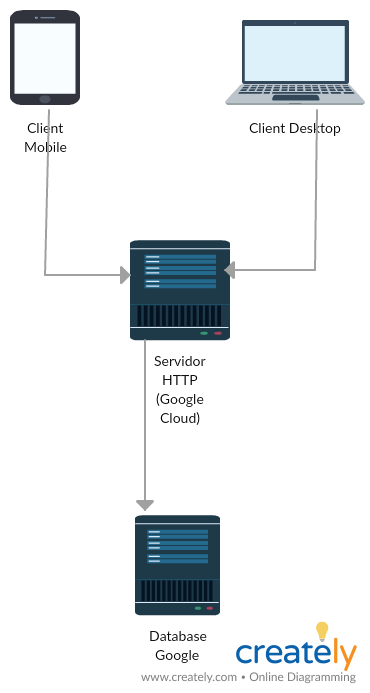

# Modelo de Arquitetura

## Organização em camadas

* Para o front-end utilizamos um SPA com ajax consultando as API's do sistema e renderizando os conteudos necessarios. Para versões mobiles, criamos um manifest.json transformando a pagina em PWA (podendo ser salva como aplicativo nos smartphones).
* Para o Back-end criamos uma estrutura de REST API em Lumen (laravel) que consulta nossa base de daos e responde JSON para o front-end
* Para o Base de dados utilizamos MySQL.

### Cloud Solutions

* Utilizamos o Google Cloud Computer para hospedar o front-end e o back-end, utlizando uma camada de Nginx para fazer o gerenciamento de aplicações e o roteamento do back-end e front-end.

* Utilizamos o Google Cloud SQL para hospedar o banco de dados MySQL.

