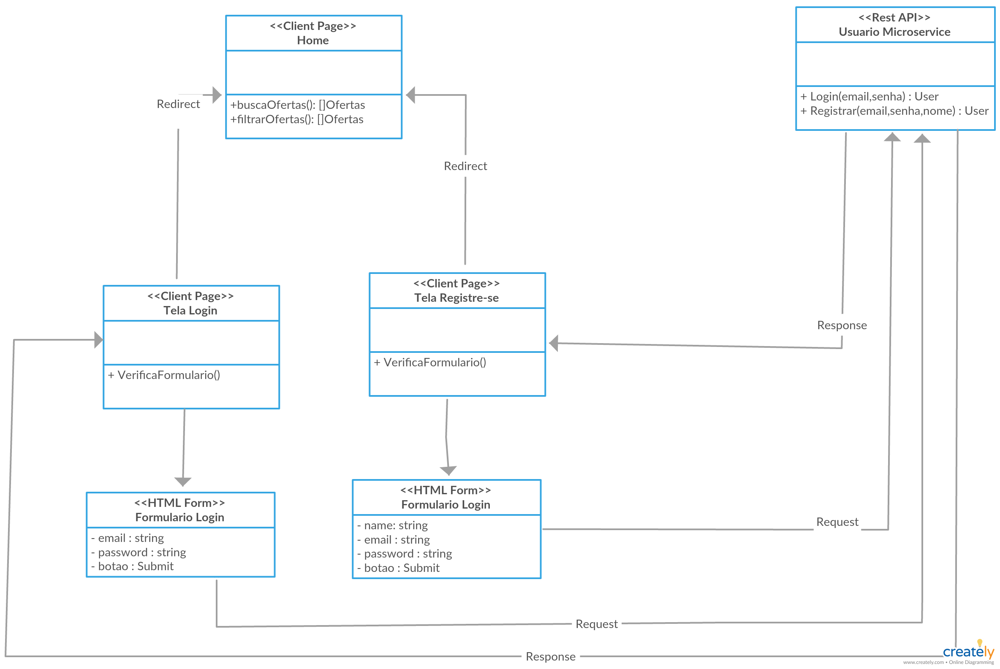

# Detalhamento dos componentes

Os componentes estão organizados em RestAPI, separamos no diagrama em funcionalidades principais para melhor entendimento

# Componentes baseados em Microservices

## Login e Registre-se (Escopo do Usuario)

## Busca Promoções

## Cadastra Promoções

